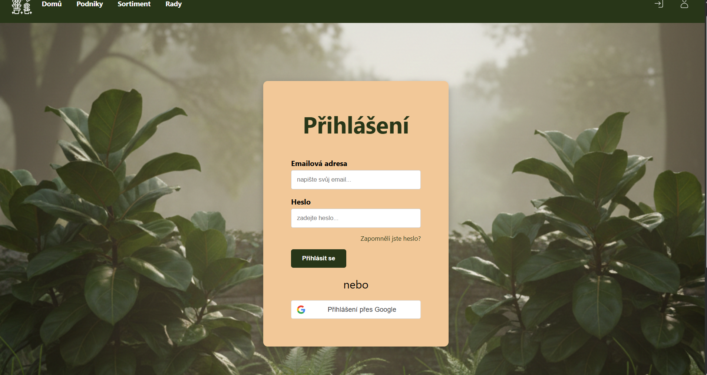
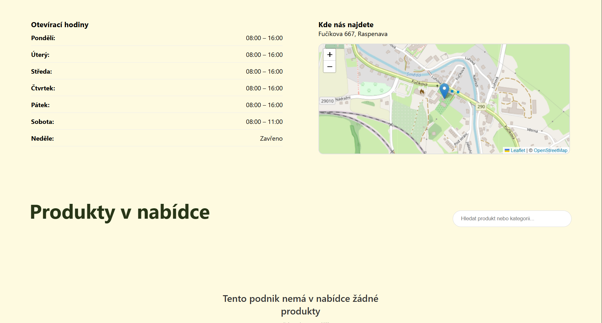
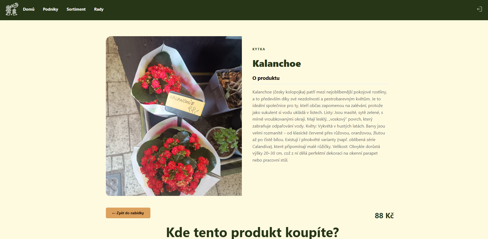
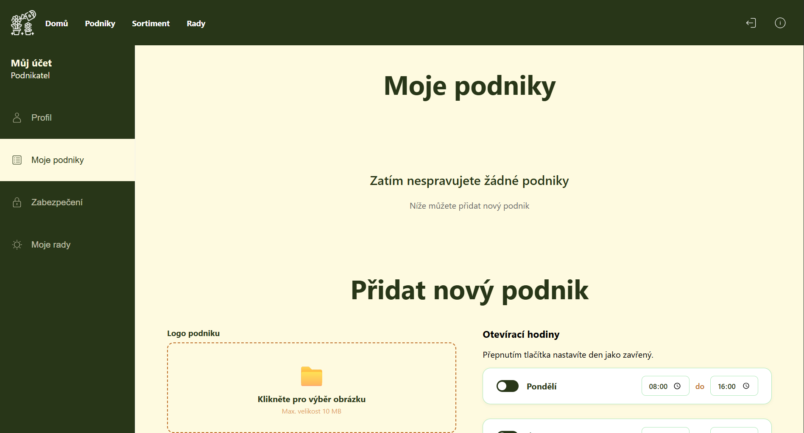
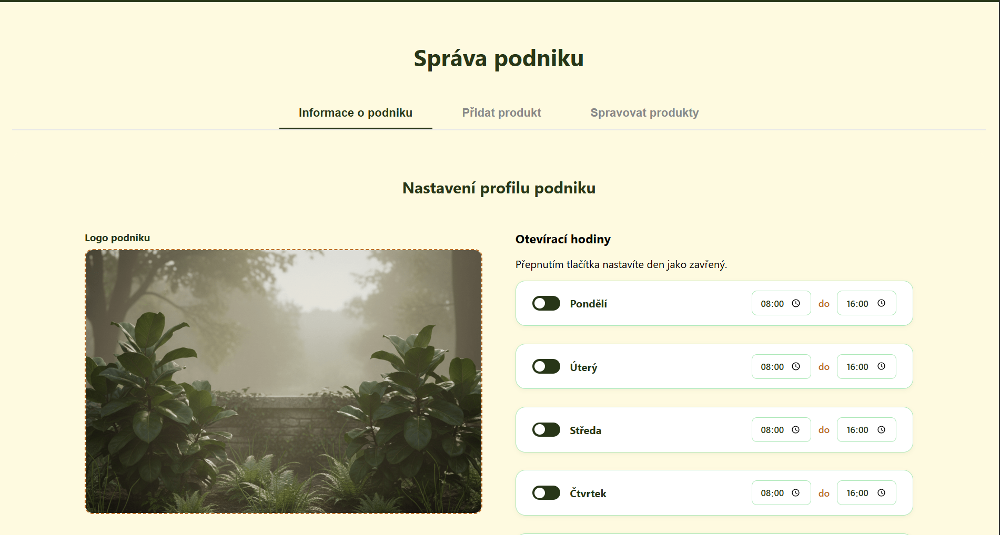
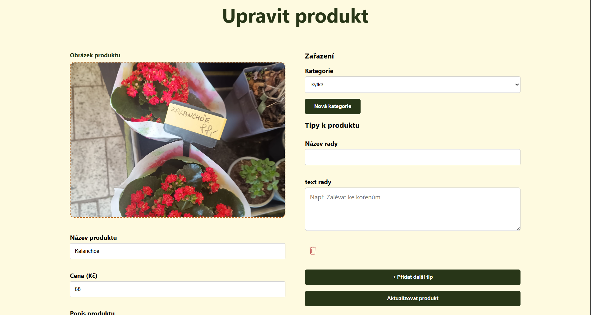

# Webová aplikace pro zahradnictví a zahrádkáře

Tato aplikace vznikla v rámci bakalářské práce na TUL
## Funkce
### Pro podniky
- Aplikace nabízí vytvoření vlastního profilu s kompletními informacemi o podniku
- Umožňuje propojení daných produktů s radami a jejich rozřazení do kategorií

### Pro uživatele
- Nabízí přehled všech podniků a jejich produktů na jednom místě
- Možnost filtrace, řazení a vyhledávání konkrétního sortimentu
- Prohlížení rad k produktům

## Použité technologie
- Frontend - React JS
- API - ASP.NET Core C#
- Databáze - PostgreSQL

## Obrázky z aplikace

> Přihlašovací obrazovka

> Detail podniku

> Detail Produktu

> Profil

> Správa podniku

> Úprava produktu

